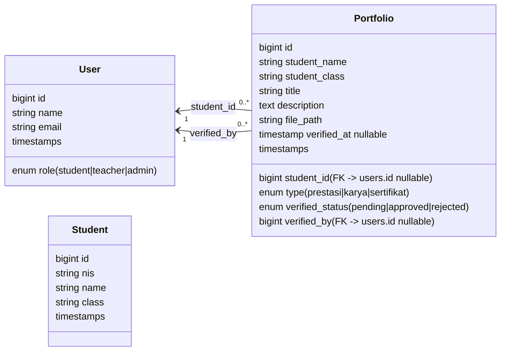

# 🎓 Sistem Portfolio Siswa

Sistem manajemen portfolio siswa yang lengkap dengan fitur upload file, verifikasi guru, dan access control berbasis role.

---

## 📚 DOKUMENTASI LENGKAP

Silakan baca dokumentasi berikut untuk memahami sistem:

### 📋 Untuk Memulai (START HERE!)
1. **RINGKASAN_IMPLEMENTASI.md** ← **BACA INI DULU**
   - Checklist semua file yang dibuat
   - Quick start guide
   - Database schema
   - Testcase verification

2. **SETUP_AWAL.md**
   - Setup step-by-step
   - Konfigurasi User model
   - Database migration
   - Membuat test users
   - Troubleshooting

### 📖 Dokumentasi Teknis
3. **DOKUMENTASI_PORTFOLIO.md**
   - Panduan lengkap sistem
   - Alur kerja detail
   - Features breakdown
   - Keamanan implementation
   - Deployment checklist

4. **FITUR_TAMBAHAN.md**
   - Export PDF
   - Email notifications
   - Soft delete
   - Comments & review
   - Public share link

---

## 🚀 QUICK START

### Prerequisites
- PHP 8.1+
- MySQL 5.7+
- Composer
- Node.js (optional)

### Setup dalam 5 Langkah

```bash
# 1. Update User model dengan role column
# Edit: app/Models/User.php

# 2. Jalankan database setup
php artisan migrate

# 3. Link storage untuk file upload
php artisan storage:link

# 4. Register policy di AuthServiceProvider
# Edit: app/Providers/AuthServiceProvider.php

# 5. Jalankan seeder (optional)
php artisan db:seed

# 6. Clear cache
php artisan cache:clear

# 7. Start server
php artisan serve
```

**Akses:** http://localhost:8000/portfolios

---

## 👥 User Roles

| Role | Create | Read | Update | Delete | Verify |
|------|--------|------|--------|--------|--------|
| **Student** | Own | Own | Own | Own | ❌ |
| **Teacher** | ❌ | All | ❌ | ❌ | ✅ |
| **Admin** | All | All | All | All | ✅ |

---

## 📁 Struktur File yang Dibuat

```
✅ app/Models/
   ├── Student.php
   └── Portfolio.php

✅ app/Http/Controllers/
   └── PortfolioController.php

✅ app/Http/Requests/
   ├── StorePortfolioRequest.php
   └── UpdatePortfolioRequest.php

✅ app/Policies/
   └── PortfolioPolicy.php

✅ database/migrations/
   ├── create_students_table.php
   └── create_portfolios_table.php

✅ database/seeders/
   └── PortfolioSeeder.php

✅ resources/views/
   ├── layouts/app.blade.php
   └── portfolios/
       ├── index.blade.php
       ├── create.blade.php
       ├── edit.blade.php
       └── show.blade.php

✅ routes/web.php (updated)

✅ Dokumentasi (4 files)
```

---

## 🎯 Features

- ✅ **CRUD Portfolio** - Create, Read, Update, Delete
- ✅ **File Upload** - PDF/JPG/PNG, max 5MB, secure storage
- ✅ **Validasi Input** - Server & client-side validation
- ✅ **Authorization** - Role-based access control
- ✅ **Verifikasi** - Guru verifikasi portfolio siswa
- ✅ **Search & Filter** - Cari berdasarkan judul, nama, status, tipe
- ✅ **Status Tracking** - Pending, Approved, Rejected
- ✅ **Bootstrap UI** - Responsive design dengan status badges
- ✅ **Security** - CSRF protection, XSS prevention, SQL injection prevention

---

## 🧱 UML Overview (Aktual Sesuai Migrasi)



> **Catatan:** Tabel `students` berdiri sendiri (tidak punya FK) sesuai migrasi `create_students_table`. Data siswa tambahan dapat disinkronkan ke tabel `users` atau dijadikan referensi manual sesuai kebutuhan sekolah.

---

## 🗺️ ERD (Entity Relationship Diagram)

```mermaid
erDiagram
    USERS ||--o{ PORTFOLIOS : "student_id"
    USERS ||--o{ PORTFOLIOS : "verified_by"

    USERS {
        bigint id PK
        varchar name
        varchar email
        enum role
        timestamps
    }

    STUDENTS {
        bigint id PK
        varchar nis UNIQUE
        varchar name
        varchar class
        timestamps
    }

    PORTFOLIOS {
        bigint id PK
        bigint student_id FK
        varchar student_name
        varchar student_class
        varchar title
        text description
        enum type
        varchar file_path
        enum verified_status
        bigint verified_by FK
        timestamp verified_at
        timestamps
    }
```

---

## 🗄️ Database Schema & Relasi

| Tabel | Kolom Utama | Keterangan Relasi |
|-------|-------------|-------------------|
| `users` | `id`, `name`, `email`, `password`, `role` | Role column ditambahkan oleh migrasi `add_role_to_users_table`. Setiap `portfolio.student_id` dan `portfolio.verified_by` merujuk ke `users.id`. |
| `students` | `id`, `nis`, `name`, `class` | Disiapkan untuk menyimpan profil siswa lengkap. Tidak ada FK di migrasi karena portfolio langsung menunjuk `users`. Index tersedia pada `nis` & `class`. |
| `portfolios` | `id`, `student_id`, `student_name`, `student_class`, `title`, `description`, `type`, `file_path`, `verified_status`, `verified_by`, `verified_at`, `timestamps` | `student_id` nullable setelah migrasi `modify_student_id_nullable`. `verified_by` menaut ke guru/admin pada tabel `users`. Index dibuat di `student_id`, `verified_status`, `created_at` untuk performa lisensi. |

**Ringkasan hubungan:**  
- **User (role=student)** `1 - n` **Portfolio** via `student_id`.  
- **User (role=teacher/admin)** `1 - n` **Portfolio** via `verified_by`.  
- **Student table** dapat dipakai sebagai master data & di-sync ke `users`/`portfolios` lewat kolom `student_name` dan `student_class` (ditambahkan oleh migrasi `add_student_name_class_to_portfolios_table`).

---

## 🔒 Security Features

- Server-side & client-side validation
- File type & size validation
- Safe filename generation (prevent XSS)
- Policy-based authorization
- Role-based permissions
- CSRF protection
- Password hashing
- Parameterized queries

---

## 📝 API Endpoints

```
GET    /portfolios              → List portfolio
GET    /portfolios/create       → Create form
POST   /portfolios              → Store portfolio
GET    /portfolios/{id}         → Show detail
GET    /portfolios/{id}/edit    → Edit form
PUT    /portfolios/{id}         → Update portfolio
DELETE /portfolios/{id}         → Delete portfolio
POST   /portfolios/{id}/verify  → Verify (teacher/admin)
```

---

## 🧪 Testing

### Test Create Portfolio
1. Login sebagai siswa
2. Klik "Buat Portfolio Baru"
3. Isi form & upload file
4. ✓ Portfolio created dengan status "pending"

### Test Verification
1. Login sebagai guru
2. Buka detail portfolio pending
3. Verifikasi (approve/reject)
4. ✓ Status berubah & tracked

### Test Authorization
1. Siswa A buka portfolio Siswa B
2. ✗ 403 Forbidden (authorization bekerja)

---

## 🛠️ Useful Commands

```bash
php artisan serve                    Start dev server
php artisan migrate                  Run migrations
php artisan db:seed                  Run seeders
php artisan storage:link             Create storage link
php artisan cache:clear              Clear cache
php artisan view:clear               Clear view cache
php artisan tinker                   Interactive shell
```

---

## ⚠️ Troubleshooting

**File upload not working?**
```bash
php artisan storage:link
chmod -R 755 storage/
```

**Authorization error?**
```bash
# Check AuthServiceProvider.php
# Then run:
php artisan cache:clear
```

**Database error?**
```bash
# Check .env database credentials
# Then run:
php artisan migrate
```

---

## 📊 Database Schema

### Students Table
```sql
id | nis (unique) | name | class | created_at | updated_at
```

### Portfolios Table
```sql
id | student_id | title | description | type | file_path
verified_status | verified_by | verified_at | created_at | updated_at
```

---

## ✅ Checklist Sebelum Deploy

- [ ] Update User model dengan role column
- [ ] Run php artisan migrate
- [ ] Create storage link
- [ ] Register policy di AuthServiceProvider
- [ ] Buat test users (admin, teacher, student)
- [ ] Test semua CRUD operations
- [ ] Test file upload
- [ ] Test authorization
- [ ] Setup SSL certificate
- [ ] Configure backups
- [ ] Configure logging

---

## 📄 Dokumentasi Lengkap

Lihat file-file dokumentasi untuk informasi lebih detail:

| File | Konten |
|------|--------|
| RINGKASAN_IMPLEMENTASI.md | Checklist lengkap & quick start |
| SETUP_AWAL.md | Setup step-by-step & troubleshooting |
| DOKUMENTASI_PORTFOLIO.md | Panduan lengkap sistem |
| FITUR_TAMBAHAN.md | Features tambahan & enhancements |

---

## 🚢 Siap untuk Production

✅ Semua kode sudah lengkap dan aman
✅ Input validation & sanitasi
✅ Authorization checks
✅ File upload security
✅ Bootstrap responsive UI
✅ Error handling
✅ Database indexed untuk performa

---

**Status: ✅ READY FOR PRODUCTION**

Last Updated: **27 November 2025**

Untuk informasi lebih lanjut, buka **RINGKASAN_IMPLEMENTASI.md**

## 🔐 Akun Seeder (tes cepat)

Untuk mempermudah pengujian, seeder membuat beberapa akun default. Gunakan akun berikut di lingkungan pengembangan:

- Admin: `admin@example.com` / `password` (role: admin)
- Teacher: `guru@example.com` / `password` (role: teacher)
- Student sample: `siswa@example.com` / `password` (role: student)
- Siswa tambahan (dari PortfolioSeeder):
   - `budi-susanto@example.com`
   - `siti-nurhaliza@example.com`
   - `raha-pratama@example.com`
   - `eka-widyastuti@example.com`
   - `ahmad-fadillah@example.com`

Semua password default: `password` (gunakan hanya di lingkungan dev).
